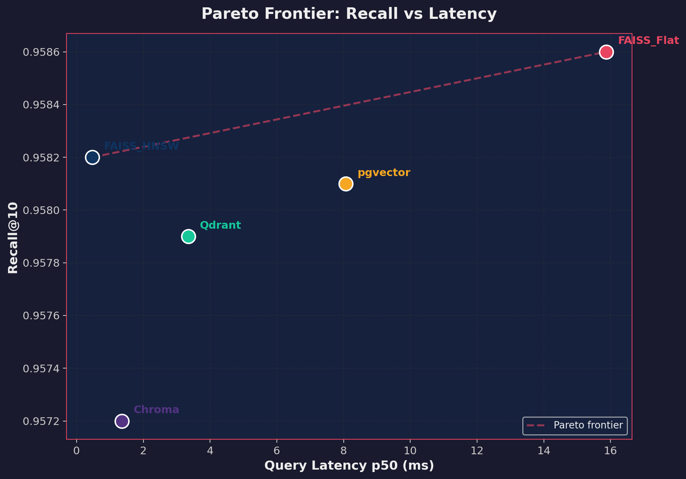
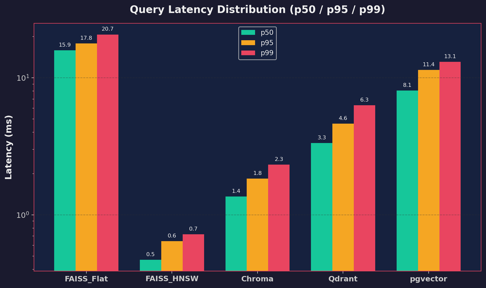
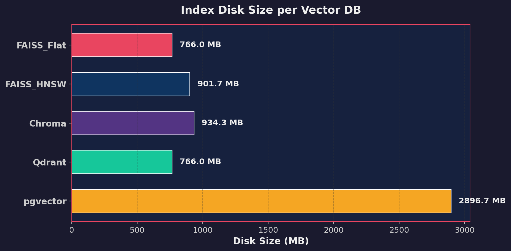

# Lesson 8: Vector Databases Benchmark Lab

This repository contains the implementation and results for the Vector DB benchmarking homework. 

## 📊 Benchmark Results & Analysis

After running the benchmark suite against the BeIR/quora dataset (~522K vectors) with `bge-small-en-v1.5` embeddings, we observed the following performance characteristics across 5 different database implementations:

### 1. Summary Table

| DB | Recall@10 | MRR@10 | p50 ms | p95 ms | p99 ms | Index (s) | Disk (MB) |
|---|---|---|---|---|---|---|---|
| **FAISS_Flat** | 0.9586 | 0.8801 | 15.869 | 17.808 | 20.683 | 0.62 | 766.0 |
| **FAISS_HNSW** | 0.9582 | 0.8801 | 0.471 | 0.642 | 0.722 | 80.62 | 901.7 |
| **Chroma** | 0.9572 | 0.8792 | 1.361 | 1.840 | 2.323 | 234.44 | 934.3 |
| **Qdrant** | 0.9579 | 0.8798 | 3.346 | 4.631 | 6.295 | 193.82 | 766.0 |
| **pgvector** | 0.9581 | 0.8798 | 8.070 | 11.419 | 13.072 | 1626.46 | 2896.7 |

### 2. Pareto Frontier (Recall vs Latency)

**Interpretation:** HNSW is the clear winner for the algorithmic tradeoff. `FAISS_HNSW` pushes the boundary all the way to the top left (extremely fast at ~0.5ms) while staying practically at the same height as the exact search (`FAISS_Flat`) for recall. The dedicated databases (Qdrant, Chroma, pgvector) sit in the middle, offering great recall but with slightly higher latencies due to network and database overhead.

### 3. Query Latency Distribution

**Interpretation:** This shows system stability under load. `FAISS_HNSW` and `Chroma` have very tight distributions, meaning even their worst-case queries (p99) are fast. `pgvector` has the highest tail latency spike (~13ms), reflecting the architectural weight of PostgreSQL's buffer managers handling the queries.

### 4. Index Disk Size

**Interpretation:** Bolting vector capabilities onto a relational database comes at a huge storage cost. `pgvector` takes almost 2.9 GB (nearly 4x the storage of Qdrant/FAISS) because it stores vectors in standard 8KB pages and builds a massive secondary index. `Qdrant` and `FAISS` are incredibly space-efficient by comparison.

### Final Conclusion
* If you need **absolute maximum speed** in a local Python script: **FAISS**.
* If you need an **easy-to-use local embedded database**: **Chroma**.
* If you need a **highly scalable production vector server**: **Qdrant**.
* If you already use PostgreSQL and need to **combine relational SQL joins with vector search**: **pgvector** (despite the massive indexing time and disk bloat).
